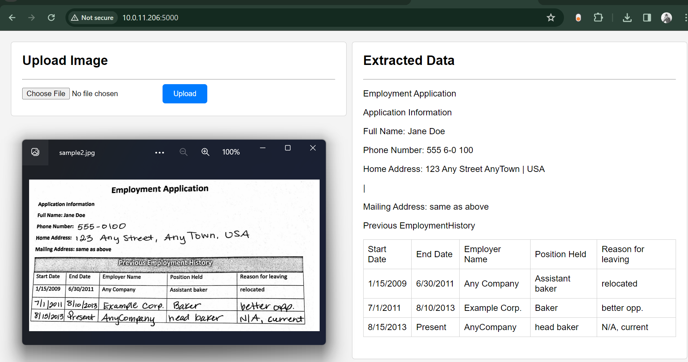

# Data Extraction from Image/PDF and Display on Frontend using Flask

This project aims to extract data from images and PDF files and display the extracted data on the frontend using Flask.

## Table of Contents
- [Data Extraction from Image/PDF and Display on Frontend using Flask](#data-extraction-from-imagepdf-and-display-on-frontend-using-flask)
  - [Table of Contents](#table-of-contents)
  - [Introduction](#introduction)
    - [Task:](#task)
  - [Features](#features)
  - [Installation](#installation)
  - [Workflow](#workflow)
  - [Sample output](#sample-output)
  - [Conclusion](#conclusion)

## Introduction

In this project, we leverage the power of optical character recognition (OCR) to extract text data from images and PDF files. The extracted data is then processed and displayed on the frontend using Flask, a lightweight web framework.

### Task:
- **Part 1: Script to extract Data from PDF**
Given a PDF document of an invoice, your task is to create a Python script that can extract key-value pairs from the document and save this data into a CSV file. The PDF will contain both header data and tabular data. Your script should be able to handle both types of data.
- **Part 2: Web Application**
Design and develop a simple web application that allows users to upload a PDF file, runs your script from Part 1 to extract data, and displays the extracted data on the webpage.

## Features

- Extract text data from images and PDF files
- Process and clean the extracted data
- Display the extracted data on the frontend using Flask

## Installation

1. Clone the repository:

   ```shell
   git clone https://github.com/Basavachari/OCR_data-extraction
    ```
2. Install the required packages:
   
   ```shell
   pip install -r requirements.txt
   ```
3. Run the Flask app:

   ```shell
    python app.py
    ```
4. Open the browser and go to `http://localhost:5000/` to view the app.
5. Upload an image or PDF file to extract the data and display it on the frontend.


## Workflow
- NanoNets OCR Model
  - The NanoNets OCR API is used to extract text data from images and PDF files. It is a cloud-based OCR service that provides a simple and easy-to-use API for extracting text from images and PDF files. The API supports a wide range of file formats, including JPEG, PNG, and PDF, and can extract text from both printed and handwritten text. The extracted text is returned in JSON format, making it easy to process and display on the frontend using Flask.
  - link for documentation of repo : [Nanonets-github](https://github.com/NanoNets/ocr-python)
- Process the extracted data
  - The extracted data is processed. This ensures that the data is displayed correctly on the frontend and is easy to read and understand.
  
## Sample output


## Conclusion
- The project aims to extract data from images and PDF files and display the extracted data on the frontend using Flask. The extracted data is processed and cleaned to ensure that it is displayed correctly on the frontend. The project leverages the power of optical character recognition (OCR) to extract text data from images and PDF files, making it easy to process and display the extracted data on the frontend using Flask.
